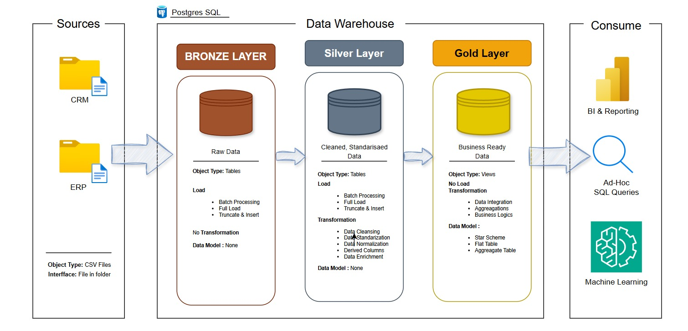

<h1 align="center">🏗️ End-to-End Data Warehouse using PostgreSQL</h1>

A modern Data Warehouse solution built with PostgreSQL that integrates CRM and ERP data into a layered architecture (Bronze, Silver, and Gold) using ETL pipelines, data quality validation, and dimensional modeling to deliver clean, analytics-ready data.

---

# 📖 Project Overview

In modern organizations, there is always a challenge when trying to analyze data from various sources since the data may have inconsistency in formatting, duplicates, and poor data quality.

In this project, we create a Data Warehouse with PostgreSQL as a database technology, based on the industry standard Medallion Architecture (Bronze → Silver → Gold).

For this project, we combine data from two sources in one Data Warehouse with the help of ETL process implemented via Stored Procedures. We load raw data into the Bronze layer, transform and clean up data in the Silver layer, and model it into business-friendly data views in the Gold layer in the form of Star Schema including Fact and Dimension tables.

This project focuses on creating clear architecture, data validation, reusing SQL development efforts, and designing an effective Data Warehouse.

---

    

## 🎯 Project Objectives

- Build a modern Data Warehouse using PostgreSQL.
- Integrate CRM and ERP datasets into a unified repository.
- Implement a layered Medallion Architecture (Bronze, Silver, Gold).
- Develop automated ETL pipelines using Stored Procedures.
- Perform data cleansing, validation, and standardization.
- Design a Star Schema with Fact and Dimension tables.
- Deliver business-ready datasets optimized for analytical workloads.

---

## 🛠️ Tech Stack

| Technology | Purpose |
|------------|---------|
| PostgreSQL | Database Management System |
| SQL | Data Definition & Query Language |
| Stored Procedures | ETL Automation |
| Data Warehousing | Layered Warehouse Architecture |
| Star Schema | Dimensional Data Modeling |
| Git & GitHub | Version Control |

---
