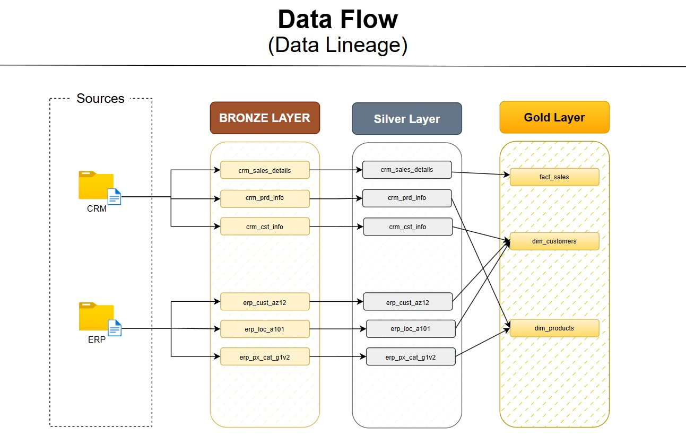
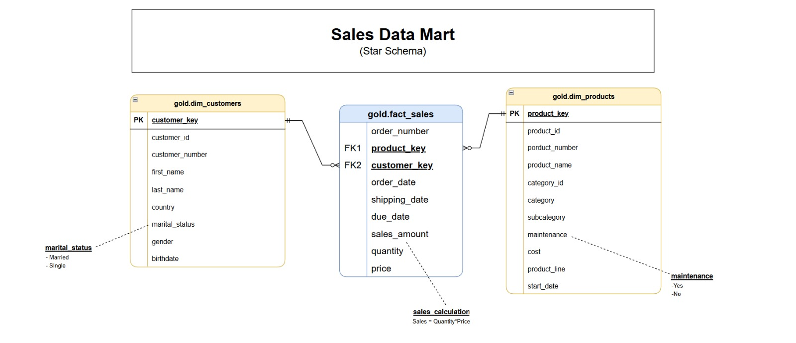

<h1 align="center">🏗️ End-to-End Data Warehouse using PostgreSQL</h1>

<p align="center">
A modern Data Warehouse solution built with PostgreSQL that integrates CRM and ERP data into a layered architecture (Bronze, Silver, and Gold) using ETL pipelines, data quality validation, and dimensional modeling to deliver clean, analytics-ready data.
</p>

<p align="center">


</p>

---

# 📖 Project Overview

In modern organizations, there is always a challenge when trying to analyze data from various sources since the data may have inconsistency in formatting, duplicates, and poor data quality.

In this project, we create a Data Warehouse with PostgreSQL as a database technology, based on the industry standard Medallion Architecture (Bronze → Silver → Gold).

For this project, we combine data from two sources in one Data Warehouse with the help of ETL process implemented via Stored Procedures. We load raw data into the Bronze layer, transform and clean up data in the Silver layer, and model it into business-friendly data views in the Gold layer in the form of Star Schema including Fact and Dimension tables.

This project focuses on creating clear architecture, data validation, reusing SQL development efforts, and designing an effective Data Warehouse.

---

<p align="center">
    
</p>

## 🎯 Project Objectives

- Build a modern Data Warehouse using PostgreSQL.
- Integrate CRM and ERP datasets into a unified repository.
- Implement a layered Medallion Architecture (Bronze, Silver, Gold).
- Develop automated ETL pipelines using Stored Procedures.
- Perform data cleansing, validation, and standardization.
- Design a Star Schema with Fact and Dimension tables.
- Deliver business-ready datasets optimized for analytical workloads.

---

## 🛠️ Tech Stack

| Technology | Purpose |
|------------|---------|
| PostgreSQL | Database Management System |
| SQL | Data Definition & Query Language |
| Stored Procedures | ETL Automation |
| Data Warehousing | Layered Warehouse Architecture |
| Star Schema | Dimensional Data Modeling |
| Git & GitHub | Version Control |

---

---

# 🏛️ Data Warehouse Architecture

The project follows a **Modern Medallion Architecture** that transforms raw CRM and ERP datasets into trusted, analytics-ready data through three distinct layers: **Bronze**, **Silver**, and **Gold**.

Each layer has a specific responsibility to ensure data quality, scalability, and maintainability.

### Architecture Layers

| Layer | Purpose |
|-------|---------|
| 🥉 Bronze | Stores raw data ingested directly from CRM and ERP source systems without modification. |
| 🥈 Silver | Cleanses, standardizes, validates, and transforms raw data into consistent datasets. |
| 🥇 Gold | Creates business-ready dimensional models using Fact and Dimension tables for analytical workloads. |

---

# 🔄 Data Flow

The ETL pipeline integrates multiple operational systems into a centralized Data Warehouse following a structured transformation process.

<p align="center">
    
</p>

### ETL Workflow

```text
CRM & ERP Source Data
          │
          ▼
   Stored Procedure ETL
          │
          ▼
   Bronze Layer (Raw Data)
          │
          ▼
Silver Layer (Clean & Standardized)
          │
          ▼
Gold Layer (Star Schema)
          │
          ▼
Business Ready Data
```

### Data Processing Pipeline

- Extract data from CRM and ERP source systems.
- Load raw data into the Bronze layer.
- Perform data cleansing, validation, and transformation in the Silver layer.
- Build Fact and Dimension tables in the Gold layer.
- Deliver trusted datasets for Business Intelligence and Data Analytics.

---

# 📂 Repository Structure

```text
Data-Warehouse-SQL-Project/
│
├── datasets/
│   ├── source_crm/
│   └── source_erp/
│
├── docs/
│   ├── data_architecture.png
│   ├── data_inetgration.png
│   ├── sales_data_mart.png
│   ├── data_flow.png
│   └── *.drawio
│
├── scripts/
│   │
│   ├── bronze/
│   │   ├── ddl_bronze.sql
│   │   └── procedure_load_bronze.sql
│   │   
│   │
│   ├── silver/
│   │   ├── ddl_silver.sql
│   │   └── procedure_load_silver.sql
│   │   
│   │
│   ├── gold/
│   │   └── ddl_gold.sql
│   │
│   │
│   ├── tests/
│   │   ├── quality_checks_silver.sql
│   │   └── quality_checks_gold.sql
│
├── LICENSE
└── README.md
```

### 📂 Repository Overview

| Directory / File | Description |
|------------------|-------------|
| **datasets/source_crm/** | Contains raw CRM source datasets used as input for the ETL pipeline. |
| **datasets/source_erp/** | Contains raw ERP source datasets used as input for the ETL pipeline. |
| **docs/** | Stores project documentation, architecture diagrams, data flow illustrations, Draw.io files, and design artifacts. |
| **scripts/bronze/** | Creates Bronze layer tables and loads raw CRM & ERP data using ETL stored procedures. |
| **scripts/silver/** | Creates Silver layer tables and transforms raw data into clean, standardized datasets. |
| **scripts/gold/** | Creates the Gold layer, including Fact and Dimension tables following a Star Schema design. |
| **scripts/tests/** | Contains SQL-based data quality validation scripts for the Silver and Gold layers. |
| **LICENSE** | Defines the licensing terms for using and distributing this project. |
| **README.md** | Provides complete project documentation, architecture, setup instructions, and implementation details. |

---

---

# 🥉 Bronze Layer

The **Bronze Layer** serves as the ingestion layer of the Data Warehouse.

It stores data exactly as received from the CRM and ERP source systems without applying business transformations. This layer acts as the historical landing zone and preserves the original source data for traceability and auditing.

### Responsibilities

- Ingest raw CRM data
- Ingest raw ERP data
- Preserve source data integrity
- Maintain historical records
- Support repeatable ETL processing

---

# 🥈 Silver Layer

The **Silver Layer** is responsible for improving the quality of the raw data.

Data is cleaned, standardized, validated, and transformed into consistent datasets suitable for downstream analytical processing.

### Transformation Activities

- Data cleansing
- Standardization
- Duplicate handling
- Null value validation
- Data type conversion
- Business rule implementation
- Data consistency validation

---

# 🥇 Gold Layer

The **Gold Layer** represents the business-ready presentation layer of the warehouse.

Data is organized using a **Star Schema**, consisting of **Fact** and **Dimension** tables to support efficient analytical queries and future Business Intelligence solutions.

### Gold Layer Components

- Fact Tables
- Dimension Tables
- Business Views
- Analytics-ready datasets
- Optimized query structure

### Dimensional Model

<p align="center">
    
</p>

---

# ✅ Data Quality Framework

Maintaining high-quality data is a core objective of this project.

Quality validation is performed during the ETL process to ensure consistency, reliability, and accuracy before data reaches the Gold layer.

### Data Quality Checks

✔ NULL Value Validation

✔ Duplicate Record Detection

✔ Data Standardization

✔ Whitespace & Formatting Checks

✔ Data Type Validation

✔ Invalid Date Validation

✔ Business Rule Validation

✔ Cross-table Consistency Checks

✔ Primary Key Validation

✔ Referential Integrity Checks

These validations help ensure that the warehouse contains trusted, analytics-ready data.

---

# 🛠️ Tech Stack

| Category | Technologies |
|-----------|--------------|
| Database | PostgreSQL |
| Query Language | SQL |
| ETL | PostgreSQL Stored Procedures |
| Architecture | Medallion Architecture (Bronze, Silver, Gold) |
| Data Modeling | Star Schema |
| Data Warehouse | Dimensional Modeling |
| Version Control | Git |
| Repository Hosting | GitHub |

---

## 💡 Skills Demonstrated

- SQL Development
- PostgreSQL
- ETL Pipeline Development
- Data Warehousing
- Data Modeling
- Star Schema Design
- Fact & Dimension Modeling
- Data Transformation
- Data Quality Validation
- Stored Procedure Development
- Database Design
- Git & GitHub

---

---

# 🚀 Getting Started

Follow these steps to set up and run the project locally.

## Prerequisites

Before running the project, ensure you have:

- PostgreSQL (v14 or later recommended)
- pgAdmin 4 (or any PostgreSQL client)
- Git
- CRM & ERP source datasets

---

## Installation

### 1. Clone the repository

```bash
git clone https://github.com/letstalkmandeep/Data-Warehouse-SQL-Project.git
```

### 2. Navigate to the project

```bash
cd Data-Warehouse-SQL-Project
```

### 3. Create a PostgreSQL database

Create a new database in PostgreSQL using pgAdmin or the SQL command below.

```sql
CREATE DATABASE data_warehouse;
```

### 4. Execute SQL Scripts

Run the SQL scripts in the following order:

```text
1. Bronze Layer
2. Silver Layer
3. Gold Layer
```

This sequence will:

- Create required schemas
- Create warehouse tables
- Load CRM & ERP datasets
- Execute ETL Stored Procedures
- Build Fact & Dimension tables
- Generate business-ready datasets

---

# 📄 License

This project is licensed under the **MIT License**.

You are free to use, modify, and distribute this project in accordance with the terms of the license.

For more information, see the **LICENSE** file in this repository.

---

# 🤝 Connect With Me

<p align="center">
<a href="https://www.linkedin.com/in/mandeep-singh-56333937b">

</a>
</p>

---

# ⭐ Support the Project

If you found this project helpful or learned something from it, consider giving the repository a ⭐ on GitHub.

Your support helps increase the visibility of the project and motivates future improvements.

---

<p align="center">

### Built with ❤️ using PostgreSQL, SQL, and Data Warehousing

**© 2026 Mandeep Singh**

</p>
